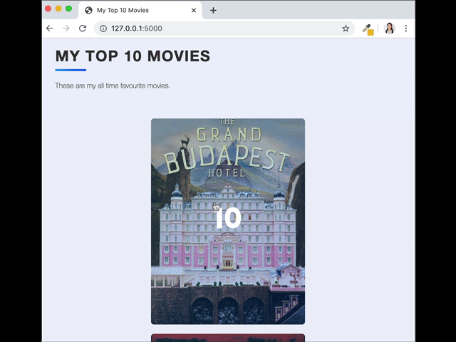

## My Top 10 Movies Website
# Objective
Today, we're going to build a website just like that using Flask/WTForms/SQLite/SQLAlchemy and more. It will allow us to create a beautiful website that lists our top 10 films of all time. As we watch more movies, we can always update our list and keep track of which movies to recommend people.

## Requirements

1. Be able to **view** movie list items
2. Be able to **edit** a movie's rating and review
3. Be able to **delete** movies from database
4. Be able to **add** new movies via the add page
5. Be able to **sort** and **rank** the movies by rating

### External python modules

***/requirements.txt*** contains the required external python modules
